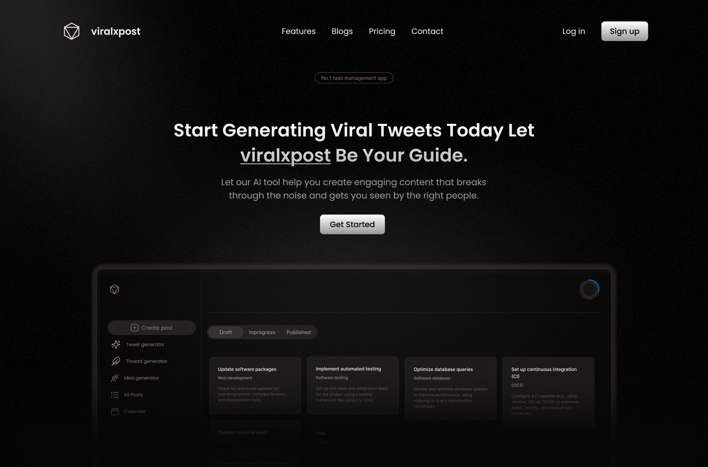

<p align="center">
  <a href="your-link-here">
    
  </a>
</p>

---

<div align="center">
  Let our AI tool help you create engaging content that breaks through the noise and gets you seen by the right people.
</div>

---



---

## Prerequisites

Before you begin setting up the project, ensure you have the following software installed on your machine:

1. **Node.js**: This is essential for running JavaScript outside the browser. You can download and install the latest version from the [official Node.js website](https://nodejs.org/).

2. **npm (Node Package Manager)**: npm is installed automatically with Node.js. It allows you to manage and install packages necessary for your project.

3. **Git**: Git is used for version control. If you don't have it installed, you can download it from the [official Git website](https://git-scm.com/).

4. **MongoDB**: MongoDB must be installed according to your operating system. Follow the installation instructions from the [official MongoDB website](https://www.mongodb.com/try/download/community).

5. **Postman** (optional but recommended): Postman is useful for testing APIs and backend endpoints. You can download it from the [official Postman website](https://www.postman.com/downloads/).
   

## Environment Configuration

Setting up the `.env` files is crucial for the project. These files store all the necessary environment variables required for the application to run, such as API keys and configuration settings. Follow these steps:

1. **Separate .env Files for Frontend and Backend**: The project uses two separate `.env` files, one for the frontend and another for the backend. Make sure to set up both configuration files properly.
    Ensure that both the frontend and backend configurations are set up correctly before proceeding with the installation.

2. **Copy the sample environment file**: The repository includes sample environment files named `.env.frontend.sample` (in the frontend directory), and `.env.backend.sample` (in the root directory). Copy these files to create your own `.env` files.

    ```sh
    cp .env.sample.frontend .env 
    cp .env.sample.backend .env  
    ```

3. **Edit the `.env` files**: Open each `.env` file in a text editor and replace the placeholder values with your actual API keys and configuration settings. You may need to add multiple API keys depending on the services your project integrates with.

    ```env
    # Example .env file
    DB_CONNECTION_STRING=your_database_connection_string_here
    ```

    Replace `your_database_connection_string_here` with your actual credentials and configuration value.

By following these steps, you will have your environment configurations properly set up for both the frontend and backend of your project.


## Installation
Follow these steps to set up the project on your local machine:

1. **Clone the repository:**

    ```sh
    git clone https://github.com/viralxpost/viralxpost-web.git
    ```

2. **Navigate to the project directory:**

    ```sh
    cd viralxpost
    ```

3. **Make the installation script executable:**

    ```sh
    sudo chmod +x install.sh
    ```

4. **Run the installation script:**

    ```sh
    ./install.sh
    ```
## Available Scripts

In the project directory, you can run:

- `npm backend` : Starts the backend server using `nodemon` with `backend/server.ts`.
- `npm frontend` : Starts the frontend development server from the `frontend` directory.
- `npm run dev` : Runs both frontend and backend concurrently using `concurrently`.


## Learning Resources
- [Reactjs](https://react.dev/)
- [Node](https://nodejs.org/en)
- [Express](https://expressjs.com/)
- [MongoDB](https://www.mongodb.com/)

## Need Help?
- [Discord](https://discord.gg/gFtTFUFFUw)
- [Twitter](https://x.com/viralxpostai)
- [support@viralxpost.xyz](mailto:viralxpost.xyz@gmail.com)


### Top Contributors
<div align="">
  <a href="https://github.com/Pawank06">
    
  </a>
  <a href="https://github.com/AvhiMaz">
    
  </a>
</div>


